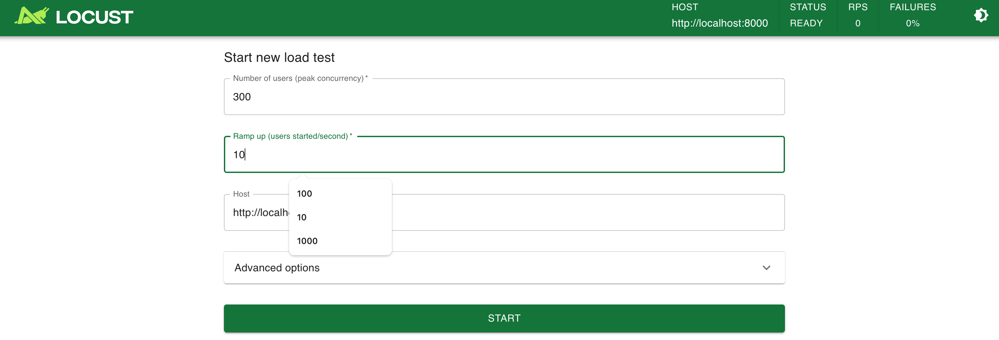
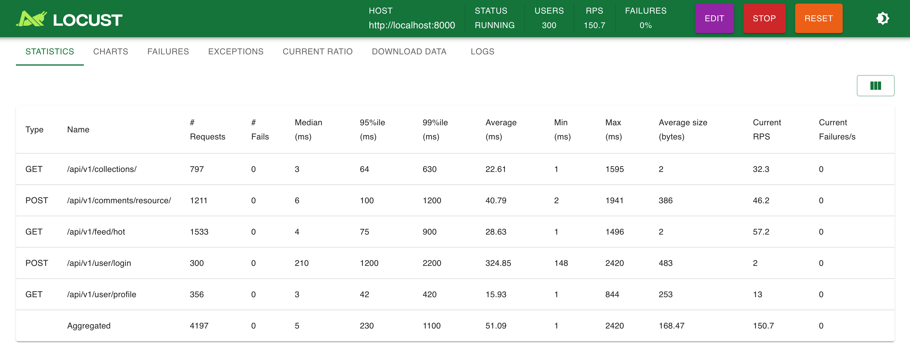
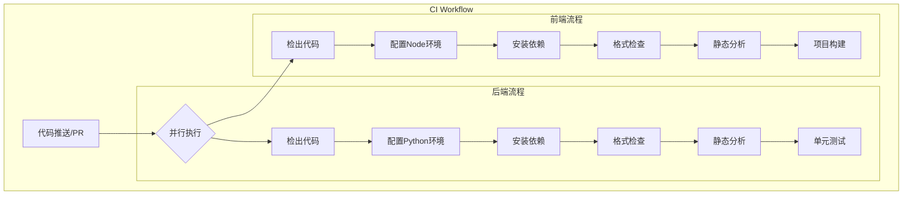

# 测试总结

## 基础要求

### 功能测试

后端编写对应接口的测试，运行 `python manage.py test` 针对 5 个模块编写 41 个测试，每个测试均有相应描述，测试结果如下，均全部通过

| 测试模块        | 测试用例名称                          | 描述                               | 结果 |
| --------------- | ------------------------------------- | ---------------------------------- | ---- |
| comment         | test_create_comment                   | 测试创建新评论                     | 通过 |
| comment         | test_delete_comment                   | 测试删除评论                       | 通过 |
| comment         | test_get_comments                     | 测试获取评论列表                   | 通过 |
| comment         | test_invalid_vote_value               | 测试无效的投票值                   | 通过 |
| comment         | test_unauthorized_access              | 测试未认证访问限制                 | 通过 |
| comment         | test_update_comment                   | 测试更新评论                       | 通过 |
| comment         | test_vote_comment                     | 测试评论投票                       | 通过 |
| comment         | test_vote_count                       | 测试投票计数                       | 通过 |
| history         | test_arxiv_paper_view_creates_history | 测试访问 ArXiv 论文时创建历史记录  | 通过 |
| history         | test_github_repo_view_creates_history | 测试访问 GitHub 仓库时创建历史记录 | 通过 |
| history         | test_repeated_views_update_history    | 测试重复访问同一资源时更新历史记录 | 通过 |
| history         | test_unauthenticated_user_no_history  | 测试未登录用户访问不会创建历史记录 | 通过 |
| pub             | test_get_arxiv_entry                  | 测试获取 ArXiv 论文条目            | 通过 |
| pub             | test_get_resource_claims_arxiv        | 测试获取 ArXiv 论文的认领列表      | 通过 |
| pub             | test_get_resource_claims_github       | 测试获取 GitHub 仓库的认领列表     | 通过 |
| pub             | test_get_user_claims                  | 测试获取用户的全部认领             | 通过 |
| pub             | test_invalid_resource_type            | 测试无效的资源类型                 | 通过 |
| pub             | test_nonexistent_resource             | 测试不存在的资源                   | 通过 |
| pub             | test_toggle_resource_claim            | 测试认领/取消认领资源              | 通过 |
| pub             | test_unauthorized_claim               | 测试未认证用户无法认领资源         | 通过 |
| user.collection | test_create_group                     | 测试创建收藏分组                   | 通过 |
| user.collection | test_delete_group                     | 测试删除分组                       | 通过 |
| user.collection | test_list_groups                      | 测试列出收藏分组                   | 通过 |
| user.collection | test_manage_group_items               | 测试管理分组内的收藏项             | 通过 |
| user.collection | test_retrieve_group                   | 测试获取单个收藏分组               | 通过 |
| user.collection | test_toggle_group_visibility          | 测试切换分组的公开/私有状态        | 通过 |
| user.collection | test_update_group                     | 测试更新分组信息                   | 通过 |
| user.collection | test_add_collection                   | 测试添加收藏                       | 通过 |
| user.collection | test_delete_collection                | 测试删除收藏                       | 通过 |
| user.collection | test_list_collections                 | 测试列出收藏                       | 通过 |
| user.collection | test_retrieve_collection              | 测试获取单个收藏项                 | 通过 |
| user.collection | test_update_collection                | 测试更新收藏项                     | 通过 |
| user            | test_authentication                   | 测试自定义认证后端                 | 通过 |
| user            | test_change_password                  | 测试修改密码                       | 通过 |
| user            | test_get_current_user                 | 测试获取当前用户                   | 通过 |
| user            | test_get_user_by_id                   | 测试通过 ID 获取用户               | 通过 |
| user            | test_register                         | 测试注册用户                       | 通过 |
| user            | test_register_validation              | 测试注册时的数据验证               | 通过 |
| user            | test_token_refresh                    | 测试 Token 刷新机制                | 通过 |
| user            | test_update_profile                   | 测试更新用户资料                   | 通过 |
| user            | test_upload_avatar                    | 测试上传头像                       | 通过 |

### 性能测试

启动后端服务后（默认为 8000 端口），目录下运行

```bash
locust -f locustfile.py --host=http://localhost:8000
```

使用 `locust` 编写模拟用户访问 5 种 API 并做高并发测试，入口界面如下，设定峰值用户为 300，每秒增加 10 个用户



在性能测试中，系统展现出良好的稳定性和可扩展性。当并发用户数达到 $300$ 时，所有接口均保持正常响应，故障率（Failure Rate）为零。除登录接口外，其他接口的平均响应时间都控制在数十毫秒级别。登录接口响应时间相对较长，这是由于系统采用了迭代散列算法对用户密码进行存储和校验，虽然牺牲了一定的响应速度，但有效地保障了系统安全性。测试结果显示，系统每秒请求数（RPS）可稳定维持在 $150$ 以上，完全满足 $300$ 名用户同时在线并进行资源访问的业务需求。



## 提高要求

### 覆盖率分析

使用 `coverage` 命令来运行测试套件，并收集覆盖率数据，并在终端生成覆盖率报告

```bash
pip install coverage
cd backend
coverage run --omit="*/migrations/*,*/tests/*" manage.py test
coverage report
```

输出整理为表格如下

| Name                                  | Stmts    | Miss    | Cover   |
| ------------------------------------- | -------- | ------- | ------- |
| `app/__init__.py`                     | 0        | 0       | 100%    |
| `app/settings.py`                     | 34       | 0       | 100%    |
| `app/urls.py`                         | 6        | 0       | 100%    |
| `comment/__init__.py`                 | 0        | 0       | 100%    |
| `comment/admin.py`                    | 12       | 0       | 100%    |
| `comment/apps.py`                     | 4        | 0       | 100%    |
| `comment/models.py`                   | 22       | 0       | 100%    |
| `comment/serializers.py`              | 37       | 0       | 100%    |
| `comment/tests.py`                    | 98       | 0       | 100%    |
| `comment/urls.py`                     | 6        | 0       | 100%    |
| `comment/views.py`                    | 77       | 4       | 95%     |
| `crawler/__init__.py`                 | 0        | 0       | 100%    |
| `feed/__init__.py`                    | 0        | 0       | 100%    |
| `feed/admin.py`                       | 1        | 0       | 100%    |
| `feed/apps.py`                        | 4        | 0       | 100%    |
| `feed/models.py`                      | 1        | 0       | 100%    |
| `feed/serializers.py`                 | 25       | 5       | 80%     |
| `feed/tests.py`                       | 1        | 0       | 100%    |
| `feed/urls.py`                        | 4        | 0       | 100%    |
| `feed/views.py`                       | 210      | 141     | 33%     |
| `history/__init__.py`                 | 0        | 0       | 100%    |
| `history/admin.py`                    | 3        | 0       | 100%    |
| `history/apps.py`                     | 4        | 0       | 100%    |
| `history/models.py`                   | 24       | 6       | 75%     |
| `history/serializers.py`              | 33       | 6       | 82%     |
| `history/tests.py`                    | 48       | 0       | 100%    |
| `history/urls.py`                     | 5        | 0       | 100%    |
| `history/utils.py`                    | 6        | 0       | 100%    |
| `history/views.py`                    | 28       | 15      | 46%     |
| `manage.py`                           | 12       | 2       | 83%     |
| `pub/__init__.py`                     | 0        | 0       | 100%    |
| `pub/admin.py`                        | 22       | 0       | 100%    |
| `pub/apps.py`                         | 4        | 0       | 100%    |
| `pub/management/__init__.py`          | 0        | 0       | 100%    |
| `pub/management/commands/__init__.py` | 0        | 0       | 100%    |
| `pub/models.py`                       | 98       | 11      | 89%     |
| `pub/schema.py`                       | 51       | 0       | 100%    |
| `pub/serializers.py`                  | 39       | 5       | 87%     |
| `pub/tests.py`                        | 83       | 0       | 100%    |
| `pub/urls.py`                         | 4        | 0       | 100%    |
| `pub/utils.py`                        | 8        | 5       | 38%     |
| `pub/views.py`                        | 70       | 5       | 93%     |
| `sub/__init__.py`                     | 0        | 0       | 100%    |
| `sub/admin.py`                        | 12       | 0       | 100%    |
| `sub/apps.py`                         | 4        | 0       | 100%    |
| `sub/models.py`                       | 25       | 2       | 92%     |
| `sub/serializers.py`                  | 12       | 0       | 100%    |
| `sub/tests.py`                        | 5        | 1       | 80%     |
| `sub/urls.py`                         | 4        | 0       | 100%    |
| `sub/views.py`                        | 62       | 32      | 48%     |
| `user/__init__.py`                    | 0        | 0       | 100%    |
| `user/admin.py`                       | 8        | 0       | 100%    |
| `user/apps.py`                        | 4        | 0       | 100%    |
| `user/collection/__init__.py`         | 1        | 0       | 100%    |
| `user/collection/models.py`           | 34       | 0       | 100%    |
| `user/collection/serializers.py`      | 49       | 8       | 84%     |
| `user/collection/tests.py`            | 117      | 0       | 100%    |
| `user/collection/urls.py`             | 7        | 0       | 100%    |
| `user/collection/views.py`            | 42       | 0       | 100%    |
| `user/exceptions.py`                  | 10       | 0       | 100%    |
| `user/models.py`                      | 12       | 0       | 100%    |
| `user/serializers.py`                 | 33       | 0       | 100%    |
| `user/tests.py`                       | 136      | 0       | 100%    |
| `user/urls.py`                        | 5        | 0       | 100%    |
| `user/views.py`                       | 110      | 12      | 89%     |
| `utils/exceptions.py`                 | 36       | 4       | 89%     |
| `utils/feed_engine.py`                | 10       | 2       | 80%     |
| **TOTAL**                             | **1822** | **266** | **85%** |

可以看到绝大多数文件覆盖率达到 100%，总覆盖率达到 85%。

### 自动化测试配置

本项目采用 GitHub Actions 实现持续集成，通过自动化的测试和质量检查确保代码的可靠性。CI 流程针对后端 Python 项目和前端 Node.js 项目分别配置，在 main 分支的代码推送（push）和拉取请求（pull request）事件触发时执行。

**后端持续集成流程**：首先通过 `actions/checkout@v4` 检出代码，随后配置 Python 3.12 运行环境并启用依赖缓存机制。在环境准备完成后，系统依次执行依赖安装、代码格式规范检查、静态代码分析以及单元测试等步骤，确保代码质量。

**前端持续集成流程**：同样始于代码检出，继而配置 Node.js 环境并启用 npm 依赖缓存。在完成依赖安装后，系统会执行代码格式检查、ESLint 静态分析，最终进行项目构建，以验证前端代码的完整性。



通过这套完整的持续集成机制，项目能够在代码变更时快速发现并解决潜在问题（例如在开发者提交 PR 时自动检验是否出现问题），有效保障代码质量和项目稳定性。
